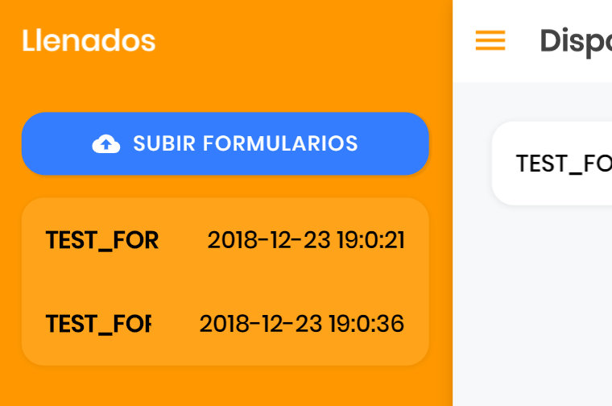

#  Nevica Forms [](https://travis-ci.org/fabrv/SalmonPier)
Nevica Forms is an app for data collection in field. We hope to help researchers with a pretty, light-weight, and easy to use app that will make data collection easier, faster and more reliable.
Every step of the project is made with extensive usability testing with the aim to make it as intuitive as possible.  

## Getting Started
These instructions will get you a copy of the project up and running on your local machine for development.

### Prerequisites
[Install Node.js](https://nodejs.org/en/download/), make sure you install the LTS version.
To verify you have succesfully installed node run this on the terminal (or console).
```
node -v
```

Once that's done, install Ionic Framework by running this command on the terminal (or console). [Check Ionic Docs for more info](https://ionicframework.com/docs/intro/installation/).
```
npm install -g ionic cordova
```
To verify you have succesfully installed ionic run this on the terminal (or console).
```
ionic -v
```

### Installing
The first step for setting the dev enviorment is installing all the npm dependecies of the application, this can be done simply by navigating to the app directory in the terminal (or console) and running this command
```
npm install
```
Great! Once that's finish you are all set to start. This software is under **GNU GENERAL PUBLIC LICENSE** so any change you make must be distributed under this same license.
Alright!, now give the app a run with the command
```
ionic serve
```

The app works with its backend companion ["SalmonPier BackEnd"](https://github.com/fabrv/SalmonPier-BackEnd) and a working database, but you can freely remix it to suit your backend.

## Built With
* [Ionic](https://ionicframework.com/)

## Contributing

Please read [CONTRIBUTING.md](#) for details on our code of conduct, and the process for submitting pull requests to us.

## Authors
* **Fabrizzio Rivera** - [fabrv](https://github.com/fabrv)

## License
This project is under the **GNU GENERAL PUBLIC LICENSE** - see [LICENSE](https://github.com/fabrv/SalmonPier/blob/master/LICENSE) for details.
